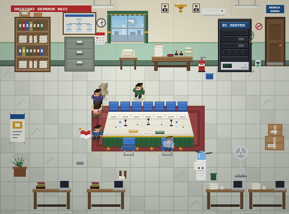

# Agent Room — Kantor Dinas

<p align="center">
  
</p>

<p align="center">
  <a href="#id">🇮🇩 Bahasa Indonesia</a> ·
  <a href="#en">🇺🇸 English</a>
</p>

---

<a name="id"></a>
## 🇮🇩 Bahasa Indonesia

Nonton sesi **Claude Code** kamu kerja — bukan di terminal, tapi sebagai
pegawai voxel 3D di kantor dinas pixel-art. Tiap sesi jadi satu orang, jalan
ke meja berbeda sesuai tool yang lagi dipakai: `Read` ke lemari arsip,
`Edit`/`Write` ke meja stempel, `git` ke PC server, `Task`/`Agent` ke meja
rapat. Lengkap Garuda, dispenser galon, AC yang netes ke ember, cuaca
sungguhan di jendela, dan 100+ kejadian iseng yang muncul sendiri.

### Jalanin

```bash
git clone https://github.com/fauzirpl/agent-room.git
cd agent-room
node dinas.mjs --pasang -g   # pasang hook (sekali saja) lalu buka kantor
```

`-g` memantau **semua** project Claude Code di mesin ini, bukan cuma folder
ini. Kalau ada sesi Claude Code yang lagi jalan, restart dulu — hook baru
kebaca waktu sesi mulai. Setelah itu, buka <http://127.0.0.1:4517>.

Belum mau pasang hook? `node dinas.mjs` lalu buka
`http://127.0.0.1:4517/?demo=1` — ruangannya jalan sendiri pakai event acak,
tanpa perlu sesi Claude Code sungguhan.

### Yang ada

- Setiap tool call Claude Code jadi gerakan di ruangan, bukan cuma baris log
- Balon pikiran & kotak kabar — isi transkrip beneran, bukan cuma nama tool
- 100+ event acak (kucing lewat, UPS berbunyi, gorengan naik ke meja rapat)
- Cuaca sungguhan di jendela + siklus siang–malam
- Notifikasi suara pas sesi selesai, plus musik lofi kantor opsional —
  semua bunyi disintesis langsung, nol file audio eksternal
- Opsional: tugaskan pekerjaan baru dan telusuri folder langsung dari halaman

Tanpa dependency — cuma butuh Node dan `curl`. Alasan di balik tiap
keputusan desain (kenapa `curl` bukan Node, kenapa hujan bukan event acak,
kenapa perintah shell dipecah dua meja, dst.) ada di **[DESIGN.md](DESIGN.md)**.
Katalog 373 event acak ada di **[EVENT-ACAK.md](EVENT-ACAK.md)**.

---

<a name="en"></a>
## 🇺🇸 English

Watch your **Claude Code** sessions work — not in a terminal, but as a
voxel-art civil servant inside a pixel-art Indonesian government office
("kantor dinas"). Each session becomes one employee who walks to a
different desk depending on which tool their agent is using right now:
`Read` sends them to the filing cabinet, `Edit`/`Write` to the stamping
desk, `git` to the server rack, `Task`/`Agent` to the meeting table.
Complete with a Garuda emblem, a water dispenser, an air conditioner
dripping into a bucket, real weather in the window, and 100+ ambient
events that fire on their own.

### Quick start

```bash
git clone https://github.com/fauzirpl/agent-room.git
cd agent-room
node dinas.mjs --pasang -g   # install the hook (once) and open the office
```

`-g` installs the hook **globally**, so it watches every Claude Code
project on this machine, not just this folder. If a Claude Code session is
already running, restart it — hooks are only read when a session starts.
Then open <http://127.0.0.1:4517>.

Not ready to install a hook yet? Run `node dinas.mjs` and open
`http://127.0.0.1:4517/?demo=1` — the room animates on its own with random
events, no real Claude Code session required.

### What's in it

- Every Claude Code tool call becomes motion in the room, not just a log line
- Thought bubbles & a news box — actual transcript content, not just tool names
- 100+ random ambient events (a cat wanders in, the UPS beeps, someone brings
  fried snacks to the meeting table)
- Real weather in the window, synced to actual conditions, plus a day/night cycle
- A sound notification when a session finishes, and optional lofi office
  music — all synthesized on the fly, zero external audio files
- Optional: assign new tasks and browse folders straight from the page

Zero dependencies — just Node and `curl`. The reasoning behind every design
choice (why `curl` instead of Node, why rain isn't a random event, why shell
commands split across two desks, etc.) lives in **[DESIGN.md](DESIGN.md)**
(Indonesian only, for now). The catalog of all 373 random events is in
**[EVENT-ACAK.md](EVENT-ACAK.md)**.
